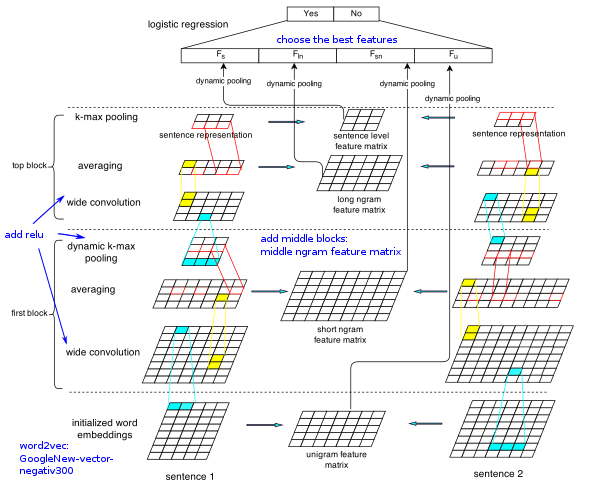

# Paraphrase Detection

This project re-implements the paper: [Convolutional Neural Network for Paraphrase Identification](https://www.aclweb.org/anthology/N15-1091). It detects whether two given sentences are paraphrase or not.


## Getting Started

### Installing

Create the environment from the *environment.yml* file:

```
conda env create -f environment.yml
```

Activate the environment:

```
conda activate paraphrase_detection
```

### Embeddings

Download pre-trained word embeddings:

[GoogleNews-vectors-negative300](https://drive.google.com/file/d/0B7XkCwpI5KDYNlNUTTlSS21pQmM/edit) (1.5GB)

or 

[GoogleNews-vectors-negative300-SLIM](https://github.com/eyaler/word2vec-slim) (264 MB)


Create a folder *embeddings* under the root of this repository, put the embddings file (.bin.gz) into it

### Preprocessing

Run the following script to tokenize the texts in *corpus* 

```
sh ./scripts/preprocessing.sh
```


## Training

### Architecture



### Build Model

```
python paraphrase_detection/main.py
```


## Test

```
python run.py
```


## License

MIT licensed. See the [LICENSE file](./LICENSE) for full details.
